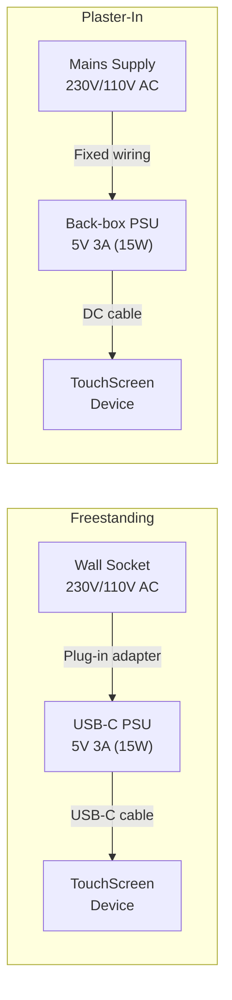

# Hardware Productisation: Next Steps

Post-prototype plan for turning the touchscreen into a manufacturable, certifiable, sellable product. Hardware focus only.

---

## 1. Manufacturing and Sourcing

Two routes worth pursuing in parallel. Get quotes from both before committing.

### Option A: China OEM (Alibaba / AliExpress)

Search for manufacturers with Raspberry Pi Compute Module carrier board experience and touchscreen panel sourcing capability.

**Search terms:** "CM4 CM5 carrier board OEM", "custom touchscreen panel manufacturer", "Raspberry Pi compute module product assembly"

**What to look for:**
- ISO 9001 certification
- Existing portfolio of Pi-based or ARM SBC products
- In-house SMT and final assembly capability
- Willingness to work with supplied components (CM5 modules)
- Typical MOQ: 500-1000 units

**Use a sourcing agent.** Direct communication with Chinese factories is doable but slow and error-prone. A sourcing agent (findable on Alibaba or via referrals) manages communication, sample QC, and factory audits for a percentage fee (typically 5-10%). Worth it for a first run.

### Option B: UK Specialist

Companies like [BVM Ltd](https://www.bvm.co.uk/) specifically market Raspberry Pi Compute Module to product transitions. They handle carrier board design, enclosure, certification support, and manufacturing.

**Trade-offs vs China:**

| Factor | China OEM | UK Specialist |
|--------|-----------|---------------|
| Unit cost | Lower (especially at volume) | Higher |
| Communication | Harder, time zone gap | Easy, same language |
| Quality control | Needs active management | Easier to oversee |
| Certification support | Unlikely | Often included |
| Lead time | 4-8 weeks + shipping | 4-6 weeks |
| First run suitability | Riskier | Safer |

**Recommendation:** Quote both. Use a UK specialist for the first production run (100-500 units) to de-risk, then move to China OEM for scale (1000+ units) once the product is proven and the BOM is locked.

### Display Sourcing

Per the hardware ideation doc, the display strategy is phased:

| Phase | Display | Source | Est. Cost |
|-------|---------|--------|-----------|
| First run | Off-the-shelf 4" 720x720 HDMI capacitive | Waveshare, The Pi Hut, AliExpress | ~£25-30/unit |
| Scale (1k+) | Custom 4" 720x720 DSI capacitive panel | Alibaba LCD manufacturer | ~£8-15/unit |

Waveshare can supply at volume and has established distribution. They're a reasonable first-run display partner. For custom DSI panels at scale, source directly from a Chinese LCD manufacturer — specify panel size, resolution, interface (MIPI DSI), and touch type (capacitive, I2C) at order.

### Carrier Board

The CM5 requires a carrier board. Options:

1. **Commission a custom design** — minimal board with only: CM5 mezzanine connector, display output (HDMI initially, DSI at scale), USB (for touch input), 5V DC power input, WiFi antenna pad. Open-source CM4 reference designs exist in KiCad as a starting point. Estimated cost: £5-10/unit at volume, plus ~£2-5k NRE for design and first PCB run.

2. **Use an existing slim carrier** — reduces NRE but may include unnecessary features (Ethernet, GPIO headers, camera connectors) that add cost and bulk. Acceptable for first run, not ideal long-term.

**Recommendation:** First run on an existing minimal carrier. Commission a custom carrier in parallel, ready for the scale run.

---

## 2. Certifications by Market

**Critical insight: keeping the device at 5V DC input avoids the EU Low Voltage Directive entirely.** LVD (2014/35/EU) only applies to equipment operating between 50-1000V AC or 75-1500V DC. A 5V device is exempt. This is the single strongest argument for using an external PSU on both form factors.

### Required Certifications

| Directive / Standard | Market | What It Covers | Applies? |
|----------------------|--------|----------------|----------|
| EMC Directive 2014/30/EU | EU | Electromagnetic compatibility — emissions and immunity | Yes |
| RED 2014/53/EU | EU | Radio Equipment Directive — WiFi/Bluetooth radio | Yes |
| RoHS 2011/65/EU | EU | Restriction of hazardous substances | Yes |
| WEEE | EU | Waste electronics registration (not testing) | Yes (registration only) |
| LVD 2014/35/EU | EU | Low Voltage Directive — electrical safety | **No** — device is 5V DC, below threshold |
| EMC Regulations 2016 (SI 2016/1091) | UK | UKCA equivalent of EMC Directive | Yes |
| Radio Equipment Regulations 2017 | UK | UKCA equivalent of RED | Yes |
| RoHS Regulations 2012 | UK | UKCA equivalent of RoHS | Yes |
| FCC Part 15 | US | Intentional radiator (WiFi) + unintentional emissions | Yes |
| FCC Part 15 Subpart B | US | Unintentional digital device emissions | Yes |
| UL/ETL listing | US | Safety listing (not legally required but expected by retailers) | Recommended |

### Cost and Timeline

| Item | Est. Cost | Timeline |
|------|-----------|----------|
| EMC + RED testing (CE/UKCA) | £3,000-6,000 | 6-10 weeks |
| FCC Part 15 testing | £2,000-4,000 | 4-8 weeks |
| RoHS compliance documentation | £500-1,000 | 2-4 weeks |
| WEEE registration (UK/EU) | £200-500 | 2-4 weeks |
| UL/ETL listing (if pursuing US retail) | £5,000-10,000 | 8-16 weeks |
| **Total (EU + UK + US)** | **£6,000-15,000** | **10-16 weeks** |

CE and UKCA can often be tested in parallel at the same test house. Many UK test houses can do both CE and FCC in one engagement.

**When to start:** Certification testing requires a production-representative sample (not a prototype). Start the process once you have units from the pilot batch. Budget for 2-3 samples to be consumed by testing.

---

## 3. Plaster-In: Extra Regulatory Considerations

This is where the power architecture decision has the biggest regulatory impact.

### Two paths, very different complexity

| Approach | What happens | Regulatory impact |
|----------|-------------|-------------------|
| **Integrated PSU** (mains inside device) | Device contains a 230V/110V to 5V converter | Triggers LVD. Triggers UK Part P (fixed electrical installation). Device must meet IEC 62368-1 (audio/video safety) or similar. Installation requires a qualified electrician. Certification cost and complexity roughly doubles. |
| **External low-voltage input** (separate PSU) | Device receives 5V DC only. A separate, pre-certified PSU is mounted in the back-box or nearby. | LVD does not apply to the device. Part P applies only to the PSU installation (standard electrical work). The device itself is certified identically to the freestanding version. |

### Recommendation

**Both variants should be 5V DC input only. No mains voltage inside the device.**

For the plaster-in variant:
- Ship with (or recommend) a back-box mountable 5V PSU — Mean Well, XP Power, or similar. These are pre-certified (CE, UL), commodity components.
- The installer wires mains to the PSU in the back-box. The PSU outputs 5V DC to the touchscreen via a short cable.
- The touchscreen device itself never sees mains voltage.

This approach:
- Keeps the touchscreen product identical electrically across both form factors
- Avoids LVD certification entirely
- Avoids Part P applying to the product (it applies to the PSU installation, which is standard electrical work)
- Reduces certification cost by ~50%
- Eliminates thermal risk from a mains-voltage converter inside a sealed wall cavity

### UK Building Regulations — Part P

Part P (Electrical Safety in Dwellings) applies to **fixed electrical installations** — i.e., anything permanently wired to the mains. Key implications:

- **If the plaster-in device is permanently wired to mains:** Part P applies. Installation is notifiable work in many cases. Must be done by a Part P registered electrician or inspected by Building Control.
- **If the plaster-in device is powered by a low-voltage cable from a separately installed PSU:** Part P applies to the PSU installation (which is a standard electrical accessory), not to the touchscreen itself. This is routine work for any electrician.

**Either way, the touchscreen product itself doesn't need Part P certification — Part P governs installation, not the product.** But designing the product to avoid mains voltage makes the installation simpler and more accessible to the installer.

There are no additional fire rating or building regulation requirements for a low-voltage, low-wattage (5-8W) device mounted in a standard back-box, provided it doesn't obstruct fire barriers in the wall cavity.

---

## 4. Power Architecture

### Design

### Freestanding

- **Input:** USB-C, 5V/3A (15W)
- **PSU:** Standard USB-C power adapter, bought-in, pre-certified. Same as a phone charger. Ship one in the box.
- **Connector:** USB-C on the device. Universal, user-replaceable cable.
- **Thermal:** Open-backed or vented enclosure. Passive heatsink on CM5. No concerns at 5-8W.

### Plaster-In

- **Input:** DC barrel jack (5.5x2.1mm) or 2-pin terminal block, 5V/3A
- **PSU:** Recommended third-party back-box PSU (Mean Well IRM-15-5, or similar). Pre-certified, off-the-shelf. ~£5-8 at volume. Installed and wired by the electrician.
- **Connector:** Not USB-C — barrel jack or terminal block is more appropriate for a permanent, in-wall connection. More robust, no accidental disconnection.
- **Thermal:** Sealed enclosure in a wall cavity with no airflow. More care needed:
  - Aluminium back plate acts as heatsink (doubles as structural mount)
  - Thermal pads between CM5 and back plate
  - Target: keep CM5 junction temperature below 80C at sustained load
  - At 5-8W total system draw, this is achievable with passive cooling. No fan needed.
  - Test in a mock wall cavity during pilot phase to validate.

### Power Budget

| Component | Typical Draw | Peak Draw |
|-----------|-------------|-----------|
| CM5 (2GB, WiFi, idle/light load) | 2-3W | 5-6W |
| 4" IPS display + backlight | 1-2W | 2-3W |
| Touch controller | <0.5W | <0.5W |
| **Total** | **3.5-5.5W** | **7.5-9.5W** |

A 15W (5V/3A) PSU provides comfortable headroom. No risk of brownout or thermal throttling under normal use.

---

## 5. Software Loading and IP Protection

### What runs on the device

The `device-agent` is a Node.js Fastify server that:
- Serves the dashboard files (static React app)
- Bridges the mobile companion app to Home Assistant via WebSocket
- Manages WiFi setup and device pairing
- Handles file operations for dashboard updates

This is **functional plumbing** — a thin client that relays data between the mobile app and Home Assistant. There is no novel algorithm, no trained model, no proprietary protocol.

### Where the real IP lives

| Component | Where it runs | Factory sees it? |
|-----------|--------------|-----------------|
| AI prompting system (Next.js + Vercel AI SDK) | Vercel cloud | No |
| Mobile companion app (React Native) | User's phone | No |
| Cloud API and user management | Vercel / hosted backend | No |
| Device agent (Fastify server) | On the Pi | Yes |
| Dashboard template (React + Tailwind) | On the Pi (placeholder only) | Yes (but it's a placeholder) |

The actual user dashboards are AI-generated per-user and loaded post-sale via the companion app. The factory only sees a default placeholder.

### Recommendation

**Don't worry about it.** Provide the factory with a complete eMMC disk image:
- Raspberry Pi OS (Lite)
- Device agent pre-installed
- Default placeholder dashboard
- Chromium kiosk configured

The on-device code has no meaningful competitive value. The factory could read it, but there's nothing to gain — it's a WebSocket relay and file server. The competitive moat is in the AI system, the mobile app, and the platform, none of which the factory ever touches.

Overcomplicating this with secure boot, encrypted firmware, or post-manufacture flashing adds cost and complexity for zero real benefit at this stage.

### Fallback (if this ever becomes a concern)

Factory flashes base Raspberry Pi OS only. Device pulls the agent code via OTA on first boot from your servers. Downsides:
- Adds internet connectivity dependency during first setup
- Adds a failure mode (download fails, server is down)
- Adds engineering effort for an OTA provisioning system
- Not worth it unless the on-device code becomes genuinely valuable

---

## 6. Next Steps

Priority-ordered. Each step should be completed before moving to the next.

- [ ] **Lock the product spec** — one-page document: must-have features only. Two SKUs (freestanding + plaster-in). CM5 2GB/16GB eMMC/WiFi. 4" 720x720 capacitive touch. 5V DC input. No scope creep.
- [ ] **Build a production-representative prototype** — use an existing CM5 carrier board, the target display, and a 3D-printed enclosure. This becomes the certification sample.
- [ ] **Get manufacturing quotes** — approach 2-3 manufacturers (at least one UK, at least one China). Provide: product spec, CAD files, BOM, target volumes (500 first run, 2000 second run). Ask for DFM feedback.
- [ ] **Commission carrier board design** — start in parallel with quoting. Use CM4/CM5 open-source reference designs as a base. Strip to essentials: CM5 connector, HDMI/DSI, USB, 5V DC input.
- [ ] **Engage a test house for certification** — get a quote and timeline for CE (EMC + RED), UKCA, and FCC. Provide them the product spec and a pre-production sample when ready.
- [ ] **Thermal validation** — test the plaster-in variant in a sealed mock back-box. Monitor CM5 temperature under sustained load. Validate that passive cooling is sufficient.
- [ ] **Pilot batch** — 50-100 units from the chosen manufacturer. Full QC inspection. Functional testing. Use these for beta testing, certification samples, and YouTube reviewer units.
- [ ] **Certification submission** — submit pilot batch samples to the test house. Run CE/UKCA and FCC in parallel.
- [ ] **WEEE registration** — register as a producer in the UK and any EU markets you plan to sell in directly.
- [ ] **First production run** — 500 units. Ship to warehouse / 3PL. Begin sales.

---

## Open Questions

- [ ] **Enclosure:** injection moulded (£10-30k tooling, £2-4/unit) vs 3D printed (no tooling, £5-15/unit)? Injection moulding only makes sense at 1000+ units. 3D print the first run.
- [ ] **Audio:** does the product need a speaker? Notification sounds, voice feedback? Adds I2S DAC + speaker to BOM (~£2-3). Decide before locking spec.
- [ ] **Ambient light sensor:** auto-brightness? Small BOM addition (~£0.50) but significant UX improvement. Decide before locking spec.
- [ ] **USB-C vs barrel jack for plaster-in:** barrel jack is more robust for permanent install. USB-C is more universal. Terminal block is most electrician-friendly. Test with target users.
- [ ] **Display brightness for plaster-in:** wall-mounted displays are often in hallways or living rooms with varying light. May need a brighter panel than the freestanding variant, or the ambient light sensor becomes essential.
